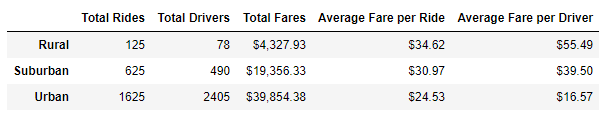
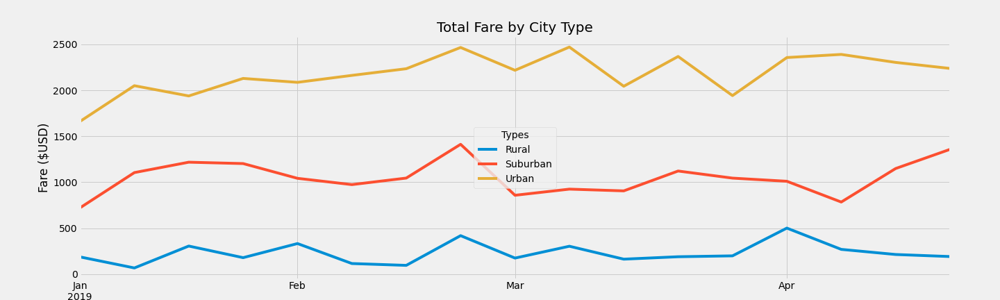

# PyBer with Matplotlib

## Overview of the analysis

The purpose of this analysis is to simulate the role of a Data Analyst for PyBer, a ride-sharing company, and provide charts based on data given in the city_data.csv and ride_data.csv. We specifically wanted to focus on the three different city types (Urban, Suburban and Rural) and compare their total fares, total amount of drivers, total amount of rides, their average fare per ride and average fare per driver. The code I wrote takes all this data and neatly outputs it into a table and chart to make analysis very efficientl and easy to understand.

## Results 
	

The above table presents the total rides, drivers and fares as well as average fare per ride and average fare per driver. Urban has the highest totals for each column 1625 rides, 2405 drivers and $39,854.38 in total fares respectively. Meanwhile Rural has the highest average fare per ride and per driver with $34.62 and $55.49 respectively. Suburban has been in the middle of the three in all categories.

The line chart above takes a 5 month snapshot of 2019's data and displays the weekly total fare for each city type starting from January to May. As we can expect Urban leads in total revenue followed by Suburban and then Rural. As we look at each individual line, Urban has the most spikes from the end of February to the beginning of April but still maintains having a large amount of revenue compared to other city types. Suburban appears to have a steady increase in the middle of April. Each city type appears to have a common spike in revenue toward the later half of March. Cooler months such as Jan and Feb appear to generate less income overall between the three city types.

## Summary and Recommendations

In conclusion, based on the statistics provided we have a clear idea of where most of Pyber's income is coming from. Urban cities account for over 60% of the total income from fares across all city types. Although their average fares per driver and per ride are the lowest, they make up for this lower amount by having more rides and drivers. Since Urban cities are typically larger in size and venues/residences are typically closer together. Urban cities will continue to generate the most income.

Rural and Suburban cities are lower in generating revenue for the business but have a lot of potential to grow. Since venues/residences are more spread out than Urban cities especially for Rural, this can result in fewer drivers, fewer rides and more costly fares per average. We can definitely explore a few ideas that can help bolster revenue in these particular cities.

1. First I would recommend pushing Urban cities to generate as much revenue as possible. One way is to increase the total number of drivers or rides for each city. Another would be focusing on advertising and making sure Pyber is the first ride sharing business that people think off while in the bigger cities.

2. Using the increase revenue from the Urban cities, start focusing on either Suburban or Rural cities by investing more into advertising as well as special deals on rides. It's important that in the smaller cities Pyber is the only ride sharing business they think off to help them get anywhere they want. Having special deals such as "every fifth ride is free of charge" can help to bolser revenue from fares since the average fares are much more expensive than in Urban cities.

3. As an overall suggestion, keeping advertising strong during warmer months such as March through May as well as the summer months to come can help keep revenue consistent. March and April in particular are Spring Break months so many people will be traveling and needing a ride. Also if advertising was well implemented in the smaller cities, those people who travel to the bigger cities for Spring Break will immediately think of Pyber.

